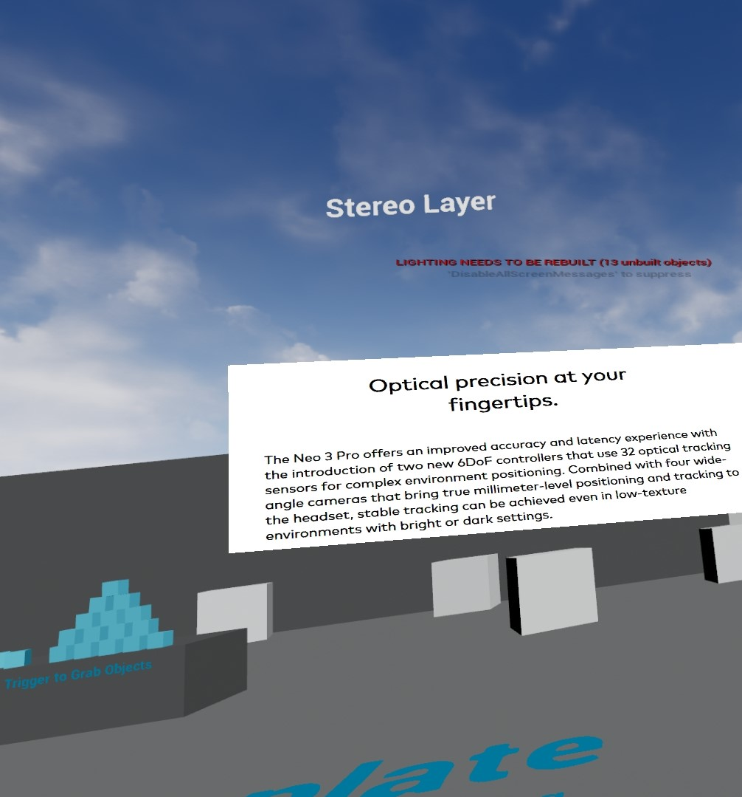

## Rendering Techniques

## Unreal Engine 4 & SDK Version
- Unreal Engine : 4.27.2

- Pico Unreal Integration SDK v2.0.5

## Description：

- Cascade Shadows

Demonstrate how cascade shadow works on Pico platform. Allows configuring parameters including 

- Text Rendering

Demonstrate different texture setups (aniso, aniso bias, mipmap, trilinear) work for text pictures on Pico platoform. And compare how stereo layer display text pictures versus non-stereolayer.

- Color Grade Map

Demonstrate how different color grade maps work on Pico devices.

## Note:
- This demo requires UE 4.27.2. To build on other versions. Please delete "Plugins" folder and download corresponding SDK file from [Pico Dev Console
](https://developer-global.pico-interactive.com/sdk?deviceId=1&platformId=2&itemId=13)
- If you have any questions/comments, please raise requests at [**PicoDevSupport Portal**](https://picodevsupport.atlassian.net/servicedesk/customer/user/login?
